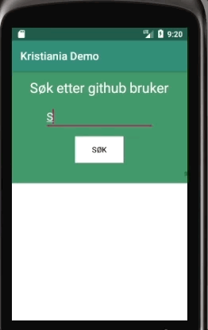

# Demo applikasjon for Høyskolen Kristiania

Dette er en demo applikasjon for å vise hvordan man kan bruke dependency injection
for å bygge Android applikasjoner. Dette kan gjøre koden enklere å teste, refaktorere kode
og bytte enkelte lag av applikasjonen.

## Litt bakgrunn om dependency injection

Dependency injection er en programmeringsteknikk der man overlater oppgaven med å opprette
objekter man avhenger av til noen andre. I stedet får man objektet man bruker for eksempel som
argument i konstruktøren.

Eksempel uten dependency injection
```java
public class MailService {
    private final Mailklient mailklient;

    public MailService() {
        mailklient = new Mailklient("https://api.selskap.no/mail");
    }

    public sendMail(
        String mottaker,
        String tekst
    ) {
        mailklient.sendEpost(mottaker, tekst);
    }
}
```
Eksempel med constructor injection
```java
public class MailService {
    private final Mailklient mailklient;

    public MailService(Mailklient mailklient) {
        this.mailklient = mailklient;
    }

    public sendMail(
        String mottaker,
        String tekst
    ) {
        mailklient.sendEpost(mottaker, tekst);
    }
}
```
Eksempel med setter injection 
````java
public class MailService {
    private Mailklient mailklient;

    public setMailklient(Mailklient mailklient) {
        this.mailklient = mailklient;
    }

    public sendMail(
        String mottaker,
        String tekst
    ) {
        mailklient.sendEpost(mottaker, tekst);
    }
}
````

## Demo applikasjon

Enkel Android applikasjon der brukeren kan taste inn et github brukernavn og få listet ut
repositoriene til brukeren.



### Dependency graf


## Biblioteker som er brukt
<ul>
    <li>Dagger: https://github.com/google/dagger</li>
    <li>Retrofit: https://square.github.io/retrofit/</li>
    <li>OkHttp: https://github.com/square/okhttp</li>
    <li>RxJava: https://github.com/ReactiveX/RxJava</li>
</ul>
